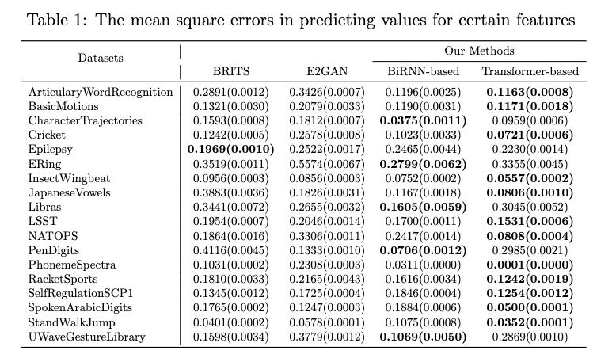
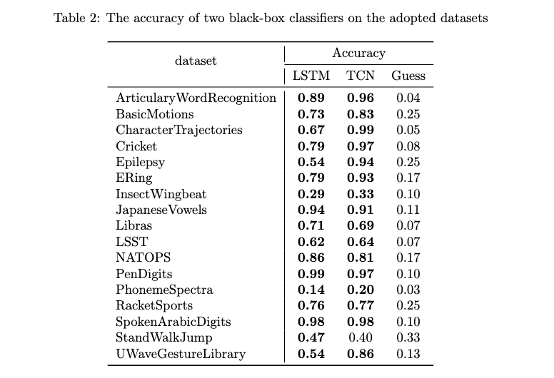
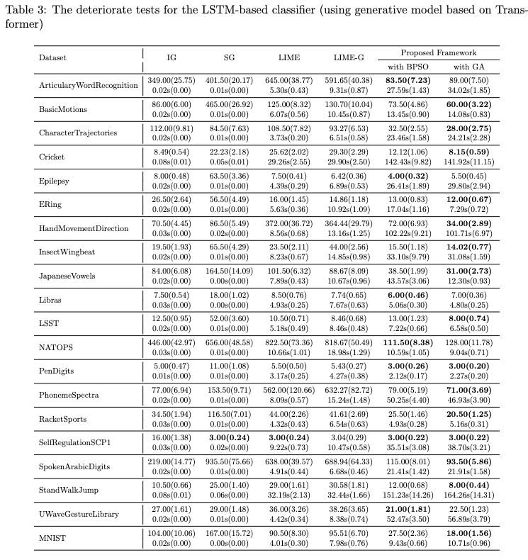
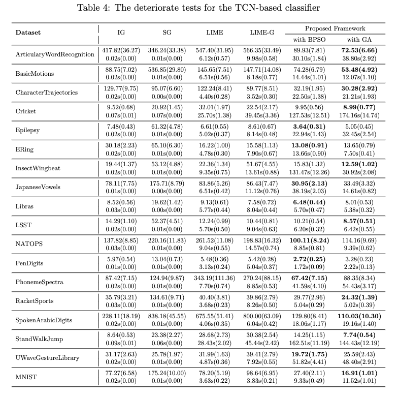

# Supplementary Materials Repository
Welcome to the Supplementary Materials Repository for our work **Explaining Time Series Classifiers trhough Meaningful Perturbation and Optimisation**. This repository contains additional resources that support our research findings.

###
To run the full experiment. Download the UEA datasets and put it into the folder /dataset/Data/MultivariateUEA/... you need to process the original datasets and save it in a numpy file. 

Train_Classifier.py -- Train the classier to be explained. 

Train_GenModel.py -- Train the generative model for realistic inputs generation.

main_train_E2Gan.py and main_rain_BRITS.py train two time series imputation models. 

Explaining.py --- explain Trained models.

Evaluation.py -- evaluation the results. 

## The performance of our model in predicting plausible values for target features

In our work, we need to generate alternative values for certain features. Time series imputation models can be used in our framework. Time series imputation tries to predict values for the missing parts, while our model generates plausible alternative values for some certain observed features. The difference of them is that for time series imputation problems, the missing parts do not have ground truth. Therefore, these models attempt to learn the temporal dependence of time series using observed values. The missing parts are then filled based on the learned temporal dependence. In our scenario, the time series we have are complete. We have the ground truth for each feature, so we do not need to predict them. Our goal is to generate alternative plausible values for certain features, which can maintain the perturbed time series within-distribution. We compare the performance of our model with two time series imputation models in predicting values for certain features, and the mean square losses are shown in the following Table 1. In our methods, we separately use BiRNNs and Transformer to encoder time series. The results shows that the Transformer-based model perform better than others.  

## The performance of our framework in explaining black-box classifiers
The results for the deteriorate test carried out on the explanations provided for the LSTM-based classifier and TCN classifiers are shown below

### The performance of two classifier on the adopted datasets

### Deteriorate tests for the LSTM-based Classifier

### Deteriorate tests for the TCN Classifier

