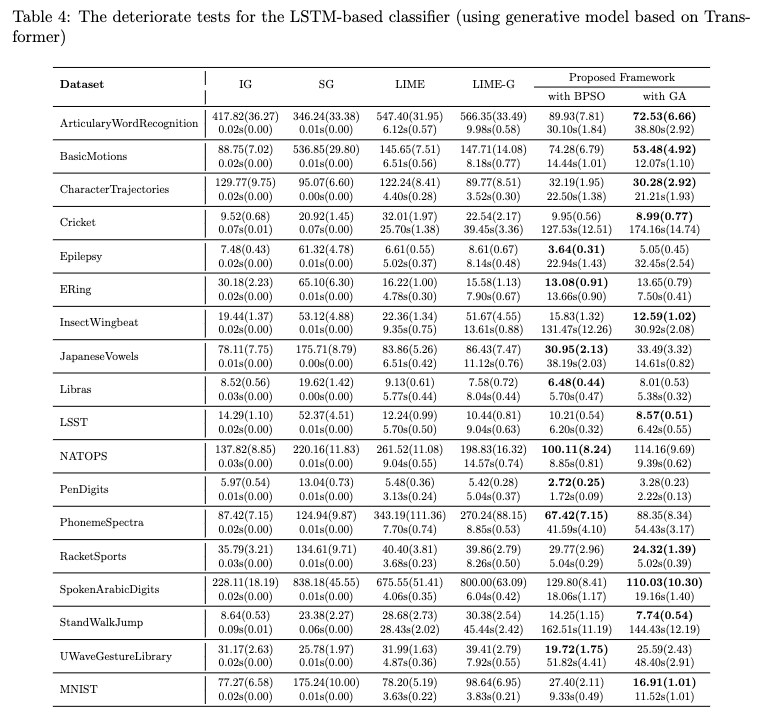

# Supplementary Materials Repository
Welcome to the Supplementary Materials Repository for our work **Explaining Time Series Classifiers trhough Meaningful Perturbation and Optimisation**. This repository contains additional resources that support our research findings.

###
To run the full experiment. Download the UEA datasets and put it into the folder /dataset/Data/MultivariateUEA/... you need to process the original datasets and save it in a numpy file. 

Train_Classifier.py -- Train the classier to be explained. 
Train_GenModel.py -- Train the generative model for realistic inputs generation.
main_train_E2Gan.py and main_rain_BRITS.py train two time series imputation models. 

Explaining.py --- explain Trained models. 
Evaluation.py -- evaluation the results. 

## The performance of our model in predicting plausible values for target features

In our work, we need to generate alternative values for certain features. Time series imputation models developed to fill missing values can be used in our framework. The scenario that these time series imputation models face is the lack of ground truth for the missing values. Therefore, the missing parts cannot be directly predicted based on the observed values. To address this challenge, these models attempt to learn the temporal dependence of time series using observed values. The missing values are then filled based on the learned temporal dependence. However, for our problem, the time series we have are complete, without any missing values. Thus, in predicting plausible values for certain observed features conditioned by their complements, we have ground truth that can be used directly to construct the loss function. We compare the performance of our model with two time series imputation models in predicting values for certain features, and the mean square losses are shown in the following table.

## The performance of our framework in explaining black-box classifiers
The results for the deteriorate test carried out on the explanations provided for the LSTM-based classifier and TCN classifiers are shown below

### The performance of two classifier on the adopted datasets

### Deteriorate tests for the LSTM-based Classifier

### Deteriorate tests for the TCN Classifier

